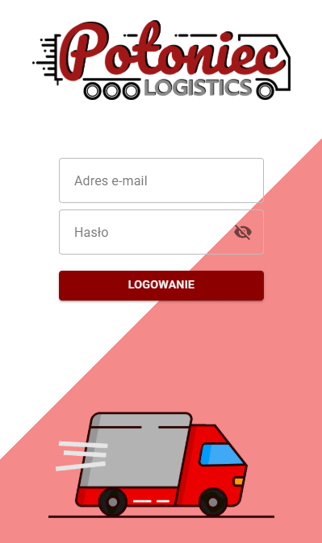
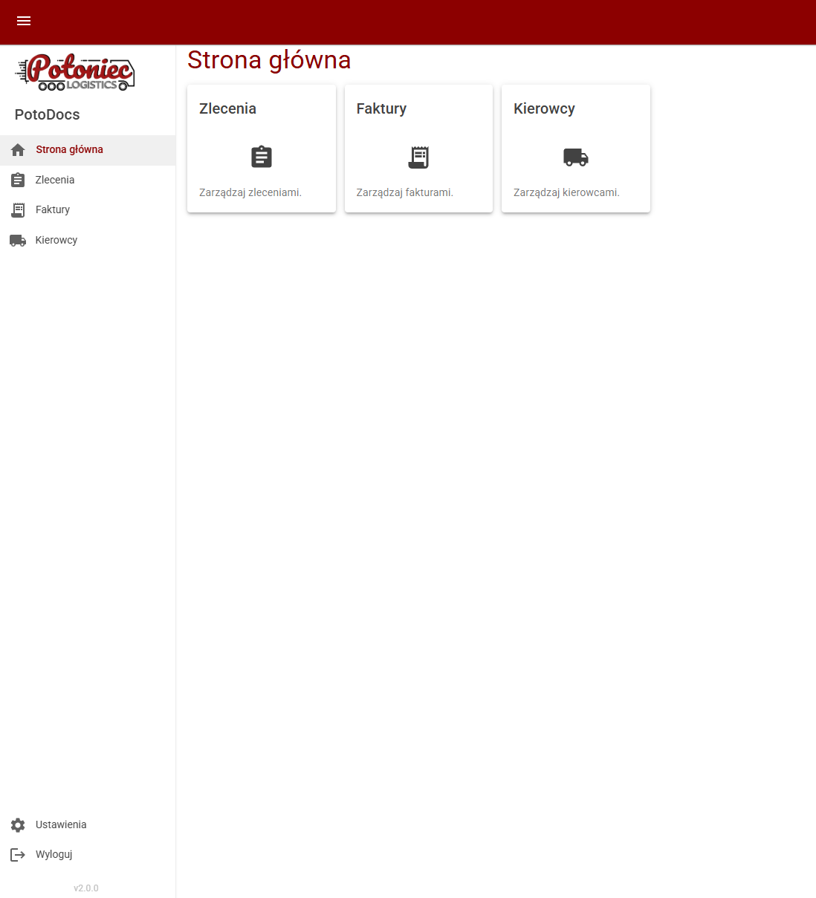
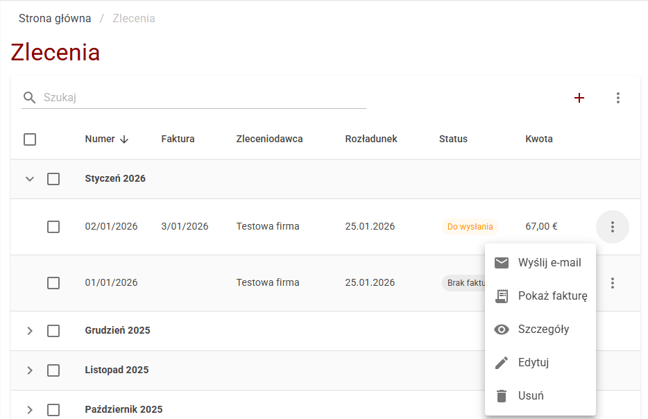
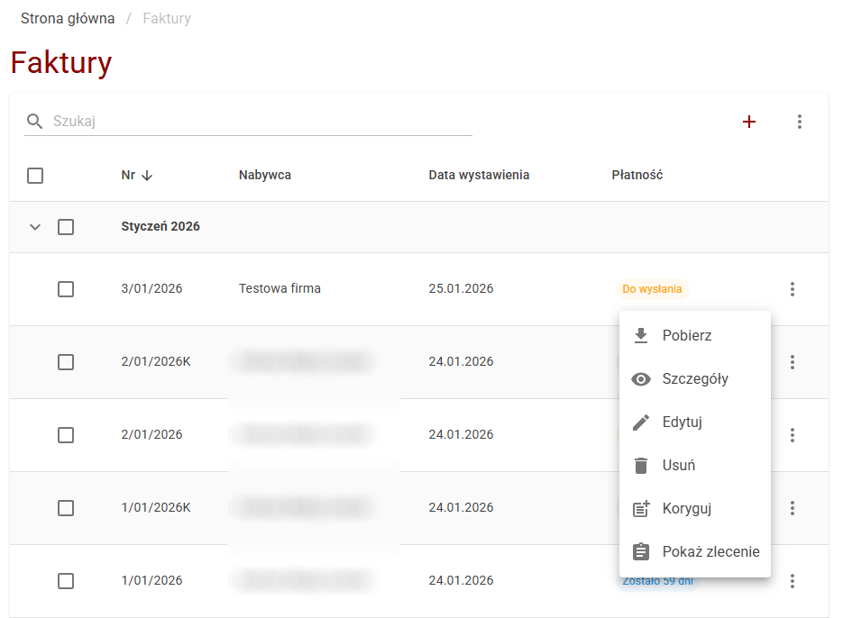
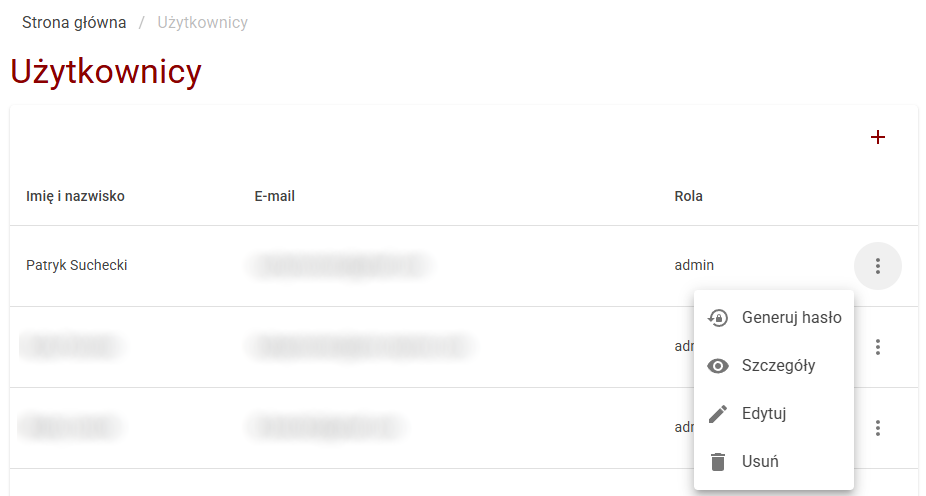
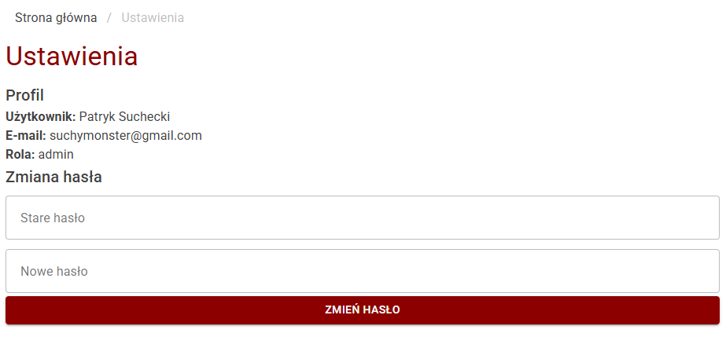

# 📦 PotoDocs

  
    

  
  
  
  
  
  

 

## 🚀 Overview

**PotoDocs** is an enterprise-grade **Transport Management System (TMS)** engineered specifically for **Potoniec Logistics**. It digitizes and automates the entire logistics workflow—from intelligent order processing and document archiving to financial invoicing and driver coordination.

Distinctive from standard CRUD applications, PotoDocs utilizes **AI (GPT-5)** to parse transport documents automatically and integrates with **Azure Cloud Services** for reliable communication, significantly reducing manual data entry.

> 🇵🇱 *Note: This application is fully localized for the Polish logistics market.*

---

## 🏗️ Production Environment & Infrastructure

The system is currently deployed in a live production environment, demonstrating full self-hosting capabilities combined with cloud integrations.

* **Server Host:** Dedicated VPS running **Debian Linux**.
* **Containerization:** The entire stack (API, UI, MariaDB) is containerized with **Docker** and orchestrated via **Docker Compose** for consistent deployment.
* **Hybrid Architecture:** Combines on-premise data sovereignty (Self-Hosted DB) with **Microsoft Azure** for scalable communication services.

---

## 💎 Key Features & Modules

### 🏠 Operational Dashboard
A centralized command center offering real-time insights into the company's logistics status.
* **KPI Visualization:** Instant access to active orders, pending invoices, and driver availability.
* **Navigation:** Streamlined sidebar interface built with MudBlazor.

---

### 🚛 Intelligent Order Management
The core module designed for high-volume logistics operations.

* **🤖 AI-Powered Automation:** Automatic generation of transport orders from scanned documents using **GPT-based API**.
* **⚡ Bulk Operations (Batch Processing):**
    * **Mass Mail Registration:** Instantly mark multiple orders as "Sent via Post".
    * **One-Click Documentation:** Bulk download of merged PDF sets (Order + CMR + Invoice) for selected records.
    * **Smart Archive:** ZIP download of all attachments for audit purposes.
* **📧 Azure Communication:** Send official orders and documents to contractors directly via **Azure Email Communication Services** for enterprise-grade deliverability.
* **💸 Instant Invoicing:** Convert any order into a VAT invoice with a single click.

---

### 💰 Financial Module & Invoicing
A robust financial engine built on top of **QuestPDF**.

* **Professional PDF Generation:** Creates high-fidelity, printable invoices and corrections.
* **NBP Integration:** Automatic retrieval of Euro (EUR) exchange rates for accurate cross-border settlements via National Bank of Poland API.
* **Correction Workflow:** Full support for issuing and managing invoice corrections.
* **Status Tracking:** Visual monitoring of payment deadlines.

---

### 🛡️ Administration & Security
Role-based access control (RBAC) ensuring data security and operational hierarchy.

* **User Lifecycle Management:** Admin panel for onboarding staff and drivers.
* **Secure Onboarding:** Auto-generation of temporary credentials sent via secure email templates.
* **Driver Database:** Specialized profiles for fleet personnel management.

---

### ⚙️ Configuration
User-centric settings for account security.

* **Security:** Self-service password rotation.
* **Profile:** Management of user-specific operational parameters.

---

## 🛠 Technical Architecture

The project follows a modern **Client-Server** architecture, utilizing strictly typed communication between the WebAssembly client and the .NET API.

| Layer | Technology Stack |
| :--- | :--- |
| **Frontend (Client)** | **Blazor WebAssembly (WASM)** with **MudBlazor** components. |
| **Backend (API)** | **ASP.NET Core Web API (.NET 8)**, RESTful endpoints. |
| **Data Access** | **Entity Framework Core** (Code-First) with **MariaDB**. |
| **DevOps & Infra** | **Docker** containers hosted on a **Debian Linux Server**. |
| **Cloud Services** | **Azure Communication Services** (Email), **OpenAI API** (GPT-4), **NBP API**. |
| **Reporting** | **QuestPDF** (High-performance fluent API for PDF generation). |

---

## 👥 Authors

* **Patryk Suchecki** - *Lead Architect & Full-Stack Developer*
* **Aureliusz Czarnacki** - *Developer & QA*